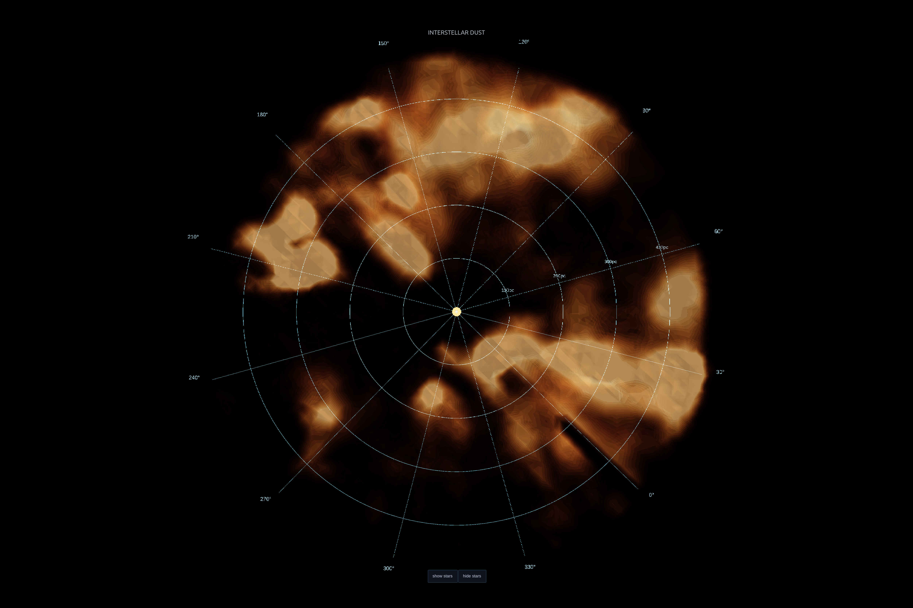
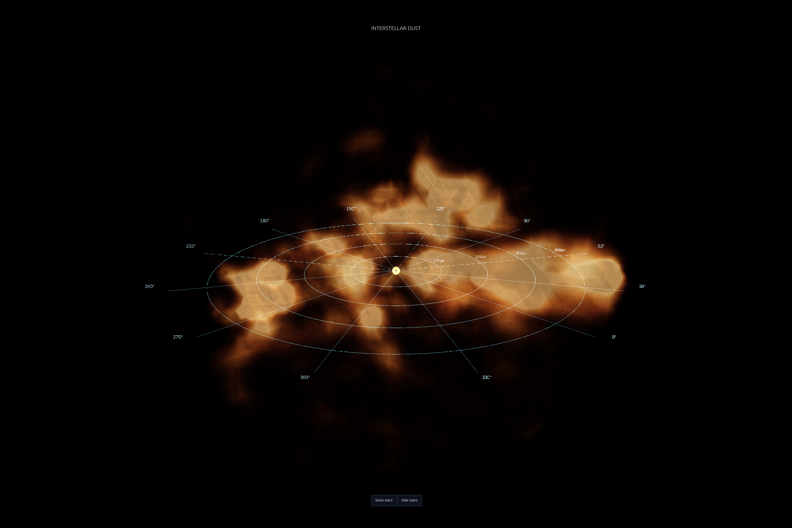

# 3D Map of Galactic Dust

A from-scratch reconstruction of the interstellar dust distribution within ~500 pc of the Sun, built from Gaia DR3 photometry. End-to-end pipeline from raw archive query to interactive 3D visualization, with all the science hand-written from first principles — no off-the-shelf dust-map library.


## What this is

Dust between stars dims and reddens their light — bluer wavelengths scatter more than redder ones, so a star behind dust appears redder than it should. By measuring this "color excess" across millions of Gaia stars at known distances, you can reconstruct the 3D distribution of dust around the Sun.

This project does that reconstruction. Inputs are raw Gaia DR3 photometry and parallaxes; outputs are a 3D dust density field on a regular galactic-coordinate grid, plus an interactive volumetric visualization.

## Approach

**Data.** ~15 million stars from Gaia DR3 with `parallax_over_error > 5` and `parallax > 0.5` (distances ≤ 500 pc). Acquired through 72 chunked ADQL queries against the Gaia archive — broken up to work around the 3M-row response cap, with retry logic and failure logging for dropped chunks across long-running pulls.

**Per-star color excess.** Stars are placed on the Hertzsprung–Russell diagram (absolute magnitude vs. BP–RP color). White dwarfs and giants are masked out. A polynomial is fit through the *blue edge* of the main-sequence locus — the edge of the cleanest, least-reddened stars at each absolute magnitude. The horizontal offset between a star's observed color and the blue-edge prediction is its color excess: how much dust sits along that line of sight.

**Spatial reconstruction.** Each star's position is converted to Cartesian galactic coordinates and loaded into a KD-tree for fast neighborhood queries. The cumulative reddening at any grid point is then a 3D-Gaussian-kernel-weighted average of nearby stars' color excess. A centered finite difference along the line of sight converts cumulative reddening to dust density.

**Visualization.** The spherical-grid density field is resampled to a Cartesian voxel grid via `scipy.interpolate.RegularGridInterpolator`, then rendered with Plotly's `Volume` trace as nested translucent isosurfaces. A custom polar overlay (radial rays at 30° steps, distance arcs at 100/200/300/400 pc, Sun marker) anchors the view to the galactic plane.

## Results


*Looking down at the galactic plane from above the north galactic pole. The Sun sits at the center; dust complexes appear as bright concentrations spread across the plane within ~500 pc.*


*Three-quarter perspective with the polar reference grid visible in the galactic plane.*

Interactive version: open `dust_volume.html` in a browser. Click and drag to rotate; the camera icon top-right exports a 4800×3200 PNG of the current view.

## Pipeline

The pipeline is split into four scripts, run in order:

1. **`data_import.py`** — chunked Gaia DR3 query, cleaning, distance and absolute-magnitude derivation. Outputs `01-gaia_results_full.csv`, then parquet files for downstream steps.
2. **`hr_diagram.py`** — HR-diagram cleaning (white dwarfs, giants), blue-edge polynomial fit, per-star color excess, baseline subtraction. Outputs `04-color_excess_full.parquet`.
3. **`dust_field.py`** — KD-tree construction, kernel-weighted cumulative reddening field, radial-gradient density. Outputs `06-dust_field.npz` and diagnostic plots.
4. **`3d_plot.py`** — Cartesian resampling, Plotly volumetric rendering, HTML/PNG/GIF export.

## Stack

`astroquery` for the Gaia archive · `numpy` and `pandas` for data work · `scipy.spatial.cKDTree` for spatial indexing · `scipy.interpolate` for grid resampling · `matplotlib` for diagnostics · `plotly` + `kaleido` for the 3D visualization and high-resolution exports.

Science code (distance modulus, blue-edge fit, kernel weighting, gradient) is hand-written. No `dustmaps` or equivalent.

## Running it

```bash
pip install -r requirements.txt
python data_import.py      # 30–90 min for the full chunked import
python hr_diagram.py       # ~1 min
python dust_field.py       # 10–30 min depending on grid resolution
python 3d_plot.py          # ~30 sec for HTML output
```

Caches (`05-stars_lb.parquet`, `06-dust_field.npz`) skip recomputation on re-runs. Delete to force a rebuild.

## Limitations

The map's *structure* is trustworthy — features sit where Bayestar (Green et al., the published reference dust map) puts them. Absolute amplitudes are not calibrated against an external reference; the dust scale is approximate. The intrinsic-color model treats all stars as main-sequence; real stellar diversity adds noise. The 500 pc distance cap (set by `parallax > 0.5`) means major dust complexes farther out (e.g. the deepest Cygnus walls) sit outside this map.

## Files

```
data_import.py       Gaia query + cleaning
hr_diagram.py        HR diagram, blue edge, color excess
dust_field.py        KD-tree, kernel reconstruction, density gradient
3d_plot.py           Volumetric rendering, GIF, angle exports
dust_volume.html     interactive viewer
dust_rotation.gif    horizontal rotation animation
renders/             high-resolution stills (8 angles)
```
